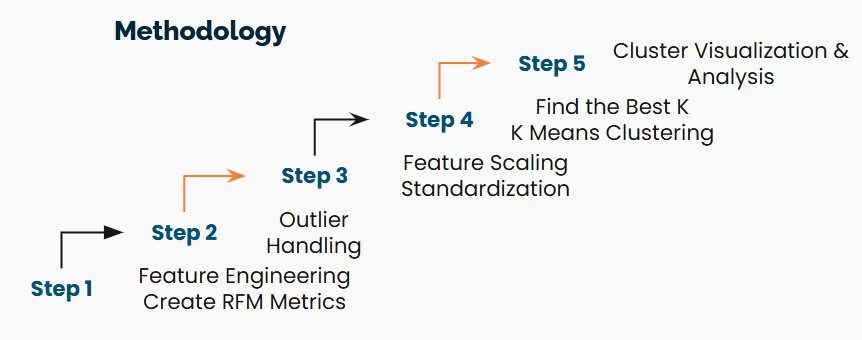
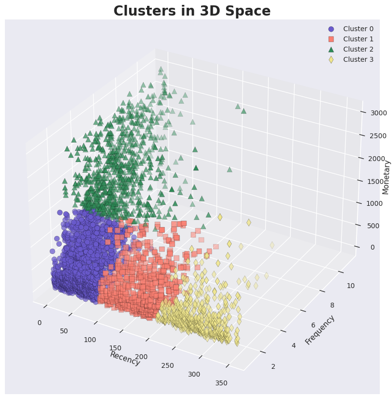
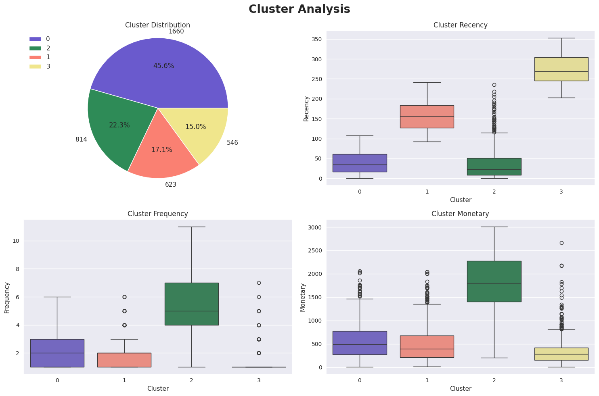
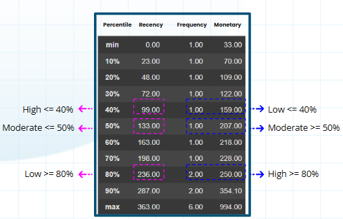
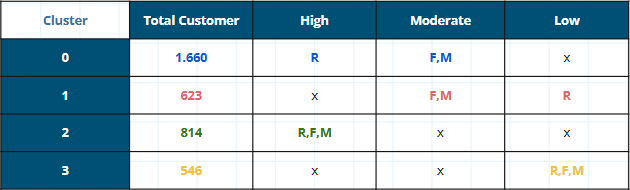

# 👥 **Optimizing Marketing Strategies with Customer Segmentation** 👥

---

## **Project Overview:**

**Business Context:**

In today's fiercely competitive e-commerce landscape, Thames E-Commerce faces the critical challenge of understanding customer behavior and optimizing marketing strategies. These insights can empower the company to make more informed decisions, improve operational efficiency, and elevate overall business performance.

**Data Source:**

This project leverages the rich dataset "E-Commerce Data | Actual transactions from UK retailer" available on Kaggle. This dataset offers a comprehensive record of transactions from a UK-based online retailer [https://www.kaggle.com/datasets/carrie1/ecommerce-data/data](https://www.kaggle.com/datasets/carrie1/ecommerce-data/data).

This is a trans-national data set that contains all the transactions occurring between 01/12/2010 and 09/12/2011 (yearly transaction) for a UK-based and registered non-store online retail, Thames E-Commerce.

The dataset contains 541909 rows and 8 columns which are:

  * **`InvoiceNo`   :** Categorical, Invoice of transactions in unique code.
  * **`StockCode`   :** Categorical, Specific product with unique code.
  * **`Description` :** Categorical, Description of detailed product information.
  * **`Quantity`    :** Numerical, Amount of units had been sold.
  * **`InvoiceDate` :** Categorical, transactions time.
  * **`UnitPrice`   :** Numerical, Price of each unit.
  * **`CustomerID`  :** Numerical, Specific customer with a unique code.
  * **`Country`     :** Categorical, Customer location by country.

**Objective:**

The primary objective of this project is to conduct an in-depth analysis of the Thames E-Commerce dataset using RFM Analysis to segment customers based on their recency, frequency, and monetary value, enabling targeted marketing campaigns.

By extracting actionable insights from it, this project seeks to enhance Thames E-Commerce's business performance, marketing effectiveness, and customer satisfaction.

**Expected Outcomes:**

  * Segment customers into meaningful groups based on their characteristics and behavior, enabling tailored marketing campaigns.
  * Provide actionable recommendations for Thames E-Commerce to optimize its marketing strategies, operational efficiency, and customer experience.

**Methodology:**

By undertaking this comprehensive analysis, Thames E-Commerce can unlock valuable insights to make optimize marketing strategies and drive sustainable growth.

---

## **Result:**

This diagram shows the distribution of customers which is divided into clusters according to the K-Means Clustering algorithm.

Clusters breakdown and their potential customer segments based on percentiles to rank the customers from the RFM metrics to identify behavior patterns:

**There are 4 clusters of customers based on RFM/purchased behavior:**

---

**Cluster 0: High recency, moderate frequency, moderate monetary**
  * `Distribution (45.57%):` Dominant cluster with 1.660 customers.
  * `Recency (around 30%):` Customers who had made purchases very recently.
  * `Frequency (above 50%):` Their purchase frequency is moderate.
  * `Monetary (around 50%):` They spend a good amount of money.

Cluster 0 represents the `Loyal Customers`. They purchased it recently and spent a good amount of money.

---

**Cluster 1: Low recency, moderate frequency, moderate monetary**
  * `Distribution (17.10%):` 623 customers.
  * `Recency (around 70%):` They had not made purchase slightly in a long time.
  * `Frequency (above 50%)`: Their purchase frequency is moderate too.
  * `Monetary (around 50%)`: They spend a moderate amount of money.

It represents the `Promising Customers`. These customers have a history of purchases but haven't bought recently

---

**Cluster 2: High recency, high frequency, high monetary**
  * `Distribution (22.34%):` 814 customers.
  * `Recency (around 20%):` These customers have purchased very recently.
  * `Frequency (above 80%):` They purchase very frequently.
  * `Monetary (above 80%):` They spend a significant high amount of money.

Yeay, Cluster 2 represents the best customers, our `Champions`, they are the company's most valuable assets. They purchase frequently, spend a lot of money, and have made purchases very recently.

---

**Cluster 3: Low recency, low frequency, low monetary**
  * `Distribution (14.99%):` The minority of the cluster, with 546 customers.
  * `Recency (above 90%):` Customers who hadn't made purchase in a long time.
  * `Frequency (below 30%):` Their purchase frequency is low, only 1 order on average.
  * `Monetary (around 30%):` They spend a small amount of money.

Very clear, it represents the `At-Risk/Lost Customers`. They haven't purchased recently and might be churned.

---

## **Recommendations for Optimizing Marketing Strategies by Customer Segments:**

`Loyal Customers`
* **Personalized Marketing:** Utilize data to tailor promotions and offers.
* **Loyalty Programs:** Implement tiered loyalty programs with exclusive rewards.
* **Customer Advocacy:** Encourage customer reviews and referrals.
* **Early Access:** Provide early access to new products or sales.

`Promising Customers`
* **Targeted Marketing:** Use email marketing and WhatsApp to promote relevant products.
* **Cross-Selling and Upselling:** Suggest complementary products or higher-tier options.
* **Personalized Offers:** Offer discounts or special deals to incentivize repeat purchases.
* **Customer Surveys:** Gather feedback to understand their needs and preferences.

`Champion Customers`
* **VIP Treatment:** Provide exceptional customer service and exclusive benefits.
* **Co-Creation:** Involve them in product development or marketing campaigns.
* **Personalized Experiences:** Tailor experiences to their individual preferences.
* **Exclusive Events:** Invite them to special events or product launches.

`Lost Customers`
* **Win-Back Campaigns:** Offer limited-time discounts or special promotions.
* **Personalized Communication:** Reach out with a sincere apology and offer to resolve any issues.
* **Re-Engagement:** Send targeted emails or WhatsApp highlighting new products or promotions.
* **Social Media Engagement:** Interact with them on social media to rekindle interest.

I hope by implementing these targeted marketing strategies, Thames E-Commerce can optimize customer engagement and drive sustainable business growth.
